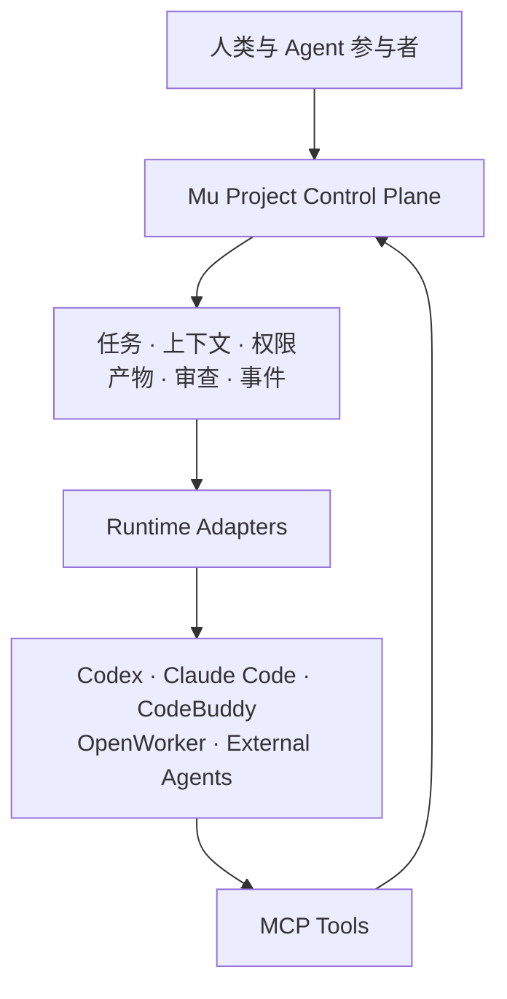

# Mu

**面向人类与 AI Agent 的项目协作操作系统。**

Mu 是一套开放架构，用于让人类、编程 Agent、研究 Agent 以及用户自带的 Agent 在同一个项目中协作。

Mu 不把 Agent 当作彼此隔离的聊天会话，而是为每个参与者提供明确的身份、任务范围、权限边界、独立工作区和审计记录。项目知识不依赖任何单一模型或 Runtime，使不同 Agent 能够在不共享私有记忆、不互相覆盖上下文的情况下协同工作。

Mu 计划通过统一的 Runtime Adapter 接入 Codex、Claude Code、CodeBuddy、OpenWorker 及外部托管 Agent，同时通过 MCP 为不同 Runtime 提供共享的工具、文件、代码仓库和外部系统访问能力。

## Mu 正在构建什么

- 以 Project 为中心的人类与 Agent 协作
- 支持用户自带 Agent，包括外部托管 Agent
- 面向不同 Agent Runtime 的统一适配层
- 可追溯、可版本化的任务级 Context Pack
- 支持多个 Agent 并行执行的隔离工作区
- 明确的权限、委派、审查与审批机制
- 能识别冲突的项目记忆，而不是一个共享 Prompt
- 可重建的执行记录，能够确认 Agent 当时获得了哪些上下文
- 供不同 Runtime 共用的 MCP 工具与集成层

## 核心原则

```text
Project State 由 Mu 管理。
Runtime State 由各 Agent Runtime 管理。
工具与外部系统通过 MCP 接入。
```

Mu 不是另一个 Agent Wrapper，也不是多模型聊天界面。

它面向以下协作场景：

- 一个人同时使用多个 Agent
- 多个人分别带自己的 Agent 加入项目
- 有人加入项目，但不带 Agent
- 某个组织只派 Agent 加入，人不直接参与
- Agent 通过任务和 Artifact 进行工作交接
- 项目决策可以跨模型、跨 Runtime 完整追溯

## 架构



Mu 希望让人类与 Agent 的协作，像现代软件开发一样结构化、可检查、可追溯、可迁移。

## 协作流程

```mermaid
flowchart LR
    project["创建或进入 Project"]
    identity["确认参与者身份<br/>人类 / Agent / 外部组织"]
    scope["定义任务范围<br/>权限边界 · 工作区 · 成功条件"]
    context["生成任务级 Context Pack<br/>版本化 · 可审查 · 可重建"]
    route["通过 Runtime Adapter 路由"]
    runtime["Agent Runtime 执行<br/>Codex / Claude Code / CodeBuddy / OpenWorker"]
    mcp["通过 MCP 调用共享工具<br/>文件 · 仓库 · 外部系统"]
    artifact["产出 Artifact 与执行记录"]
    review["人类或 Agent 审查<br/>审批 · 冲突识别 · 委派"]
    memory["更新 Mu Project State<br/>项目记忆 · 事件 · 审计记录"]

    project --> identity --> scope --> context --> route --> runtime
    runtime --> mcp --> artifact --> review --> memory
    memory --> context
```



## Current verified scope

| Area | What is implemented and verified |
| --- | --- |
| **macOS app** | Native SwiftUI Project workbench backed by SQLite and a local content-addressed evidence store. |
| **Codex** | Official stdio App Server adapter with account/thread probing, read-only turns, continuations, cancellation, history discovery, and persisted native IDs. |
| **Claude Code** | Local **stream-json** CLI adapter with bounded read-only execution, visible streaming, interruption, and local history support. |
| **OpenWorker** | Existing native macOS compatibility path with exact-workspace session binding and synchronized artifacts; it is not part of the TypeScript P0 control plane. |
| **Continuity** | Provider-neutral conversation records, exact canonical workspace matching, human-selected imports, bounded Context Packs, CAS rendering, and delivery receipts. |
| **Project UI** | Expandable Projects, endpoint/terminal-aware Agents, Markdown chat, history progress, Context state, and Files/Browser/Terminal/Review surfaces. |
| **TypeScript rewrite** | Schema-compatible **mu-ts** control plane, Fastify API/SSE server, React UI, local Codex + Claude Code hosts, and endpoint-scoped routing. |

The current build is intentionally honest about its boundary. QM is an
experimental bridge tested against Mu's mock contract, not an upstream QM
acceptance. Pi is a future adapter candidate, not a live Runtime in this
release. Mu does not claim vendor workspace writes or Runtime approval
interception where the adapter has not proved those capabilities.

## Why Mu

Mu is not a chat wrapper that merges several vendor transcripts into one
unbounded prompt. It is a control plane that lets a Project survive a Runtime
change without losing provenance:

1. **Discover** the local endpoints and their real identity.
2. **Route** a task through the capability-probed host the user selected.
3. **Review** imported history and accept only the records that belong in the
   Project.
4. **Deliver** a bounded Context Pack with workspace, actor, policy, lease, and
   receipt metadata.
5. **Audit** the resulting chat, artifacts, ledger events, and native session IDs.

The macOS UI calls the long-lived folder-backed container a **Project**. Existing
persistence and adapter contracts retain the internal `TaskRecord` name for backward
compatibility; a native Agent may still call one execution unit a task or turn.

Workspace Chat has an explicit routing rule. Text without a mention remains a
local note. `@Codex`, `@Claude`, `@OpenWorker`, or an `@Agent` routes one bounded
Project message through that Agent's verified Runtime Gateway. Codex uses the
official App Server, Claude Code uses a read-only `stream-json` CLI session, and
OpenWorker uses an attached exact-workspace sidecar session. Multiple Codex or
Claude CLI endpoints are distinguished by persisted Runtime instance identity and
stable instance-specific mentions.

Mu includes a project-scoped **Conversation Continuity Layer**. Its provider-neutral
conversation, message, provenance, revision, selection, and Context-receipt records
let a Project retain reviewed history while the user changes Agent or Runtime. The
initial built-in sources are Codex, Claude Code, and OpenWorker. `ConversationProvider`
is an open raw string identifier rather than a closed provider enum, and
`ConversationHistoryAdapter` is the injection contract for a compiled integration to
discover and hydrate another provider without adding provider-specific fields to
Mu's persistence model. A registered unknown provider can be imported and receives
a generic history UI label and treatment; this history extension point does not by
itself add live Runtime control.

Creating a Project starts with importing its folder. The user chooses which
registered history providers Mu may inspect, and the Project opens with a determinate,
real-time read-only-check progress view. The same provider selector is available from
Workspace Chat through **Find history**. Mu only invokes selected providers, then
shows conversations whose canonical workspace exactly matches the Project folder in a
visually separate review surface. The user explicitly chooses which local copies may
become eligible for bounded candidate extraction and human review. Codex history
comes from the official App Server, OpenWorker history from the verified local REST
protocol, and Claude Code history from a bounded read-only `history_only` path. Only
visible user/assistant text is copied by the built-in adapters; reasoning, thinking,
tools, system messages, and developer instructions are excluded.

Imported transcripts are Raw Sources, never Project truth and never direct Runtime
prompts. Codex, Claude Code, and OpenWorker receive a new governed Context Pack for
each turn. Only accepted, policy-authorized records and verified Artifacts can enter
the Pack. Mu pins the exact Actor, Principal, Project, Task, Workspace, Runtime
binding, fenced lease, policy versions, item hashes, rendered CAS object, and native
delivery receipt. A new accepted record, policy or Task-contract change, conflict
resolution, or missing CAS object makes an unsubmitted Pack stale.

Canonical workspace matching means exact string equality after path standardization
and symlink resolution. It is deliberately not a claim of filesystem physical
identity: beyond resolving symlinks, Mu does not use device/inode identity to merge
different resulting paths or worktrees. Claude Code's bounded local history scan
starts only when the user selects Claude Code while creating a Task or using
**Find history**; discovery
alone neither imports nor sends content. Removing Mu's local history copy also
marks its Raw Source redacted while retaining immutable audit receipts.

Mu also keeps the Agent product separate from the concrete instance that
created a conversation. Codex history preserves native `appServer`, `cli`, `exec`,
and `vscode` sources. The one local Codex desktop application is shown as
**Codex Desktop**; multiple Codex CLI and Claude Code CLI histories remain distinct
by native session and source-file identity. If vendor history does not record a TTY
or terminal name, Mu says so instead of inventing one. Runtime registration can
carry an explicit terminal identifier when an adapter or user supplies it.

Agent identities can be added or deleted, while Runtime definitions can be added or
removed from the active registry.
Removing a Runtime removes it from the active registry even when Project, Run,
Checkpoint, or Handoff records reference it. Mu preserves the endpoint history
snapshot and every reference unchanged, clears it from Agent preferred-runtime
settings, and writes a tombstone so it cannot reappear after restart. A removed
Runtime cannot be used for new scheduling, Checkpoint capture, Handoff actions, or
Codex actions.

Mu includes a live Codex App Server adapter. The app negotiates the official
stdio protocol, probes account/thread capabilities, and can dispatch an initial Project run
or a receiving Replan through `thread/start` and `turn/start`. Both paths run inside
a read-only sandbox with approval escalation disabled. The selected Mu Agent role is
included in the prompt. Native Codex thread and turn IDs are persisted as soon as
each protocol stage succeeds, and the final output is stored in the
content-addressed evidence store and append-only ledger. Exact-workspace read-only
continuations and interruption use the same native thread. Mu does not claim Codex
workspace writes or Runtime approval interception.

## TypeScript rewrite (mu-ts)

A TypeScript implementation of the Mu control plane lives in [`mu-ts/`](mu-ts/)
(pnpm monorepo), schema-compatible with the Swift SQLite store. All eight
migration phases are implemented and tested:

1. **Core domain layer** (`mu-core`): enums, record types, UUID/SHA-256, errors,
   Project Kernel, Context Kernel, Runtime Gateway manifests
2. **Persistence**: SQLite store (Swift-compatible `encodeMuJSON`), CAS
   artifact store, Git probe, domain record APIs
3. **Runtime clients**: Claude Code `stream-json` CLI and Codex App Server
   (stdio JSON-RPC); OpenWorker remains a Swift/macOS compatibility runtime,
   not part of the TypeScript P0 control plane
4. **Harness abstraction**: `Harness` interface with `LocalChildProcessHarness`
   and `QMHTTPHarness` (HMAC source auth, `/v1/turns`, SSE session states)
5. **Control plane**: `ControlPlaneService` — tasks, fencing leases, Context
   Packs with `contentSHA256`, turn dispatch, approvals, reviews, handoffs, ledger
6. **Server + API**: Fastify `buildApp(config)` with projects/agents/tasks/
   turns/context/approvals/handoffs/ledger routes and an SSE event stream
7. **Web UI**: React + Vite + Tailwind — expandable Projects tree, fixed-height
   Agent cards with endpoint/terminal identity, endpoint-scoped @Codex/@Claude
   routing, streaming Markdown chat, selectable Context Pack records, history
   discovery/import progress, runs/artifacts/handoffs/ledger, and per-turn
   automatic reasoning-effort routing (`medium`/`high`/`ultra`)
8. **Experimental QM Bridge** (not verified against upstream QM): Mu
   ContextPack → QM TurnRequest mapping and a QM HTTP client tested only
   against Mu's mock server — treated as experimental until real contract
   acceptance against a pinned QM release; plus a Swift data migration
   helper (`node scripts/migrate-swift.ts`)

```sh
cd mu-ts
pnpm install
pnpm -r test        # run all package suites
pnpm -r typecheck
pnpm --filter @mu/ui build       # build the web UI once
pnpm --filter @mu/server start   # one process = the whole app
# open http://127.0.0.1:4000 — the server also hosts the built UI
```

The server doubles as the app: after `pnpm --filter @mu/ui build`, opening
`http://127.0.0.1:4000` serves the React UI plus the API from one process.
Run `pnpm --filter @mu/ui dev` instead for live UI development (Vite proxies
to the server on port 4000).

## Requirements

- macOS 14 or newer
- Xcode 16 or newer (Xcode 26.6 is the verified build toolchain)

## Build the macOS app

```sh
./scripts/build-macos.sh
```

The signed local bundle is written to:

```text
build/Mu.app
```

Open `Package.swift` in Xcode for development, or run the `MuApp` Swift Package
scheme.

## Test

```sh
./scripts/test.sh
```

The tests exercise deterministic Checkpoint hashing, Agent and Runtime registry CRUD,
deletion tombstones and reference preservation, task/Run identity binding, routed and
local Workspace Chat, explicit native-session binding, OpenWorker protocol fixtures
and failure semantics, confined file preview, read-only terminal snapshots, dirty Git
evidence capture, a complete cross-runtime Handoff/Replan, rejection ownership
semantics, Codex protocol negotiation, staged native ID persistence, CAS/ledger
evidence, and the native read-only Codex Project/Replan event stream. Conversation
continuity coverage verifies Codex/Claude filtering, canonical workspace matching,
idempotent import, same-text/different-ordinal preservation, deterministic Unicode
Context bounds, target-aware one-time delivery, injected unknown-provider history
import, and history survival after Runtime removal.

## Current integration boundary

Mu ships two offline synthetic endpoints so the control-plane workflow remains
testable without vendor accounts. The manual artifact bridge captures Git evidence
but does not claim live runtime control. A live Codex App Server endpoint is
auto-discovered from the installed ChatGPT/Codex app and must pass an in-app probe
before scheduling. A discovered Claude Code CLI must pass executable and local-auth
probes before Mu advertises Start, Continue, visible stream events, or interruption.
Its initial safety profile permits only read/search tools and disables writes,
shell commands, and network tools. Mu discovers and can open the installed
OpenWorker Desktop application. For the
verified 0.1.6 build, an explicit probe may activate its tokenless legacy sidecar only
when it is running on `http://127.0.0.1:<port>`. The probe checks health, Agent, and
session responses before advertising Start, Continue, streaming, approval-intent,
Cancel, and artifact-discovery capabilities. Probe failure clears those claims.

Current OpenWorker source builds protect the desktop sidecar with a private,
in-memory launch token. Mu does not extract that token, scrape the embedded
webview, or persist OpenWorker credentials, so those builds remain unavailable
unless a future explicit authenticated-endpoint flow is added. Pi remains a
researched future adapter candidate and is not presented as live in this build.
Adding Pi or another provider to the Conversation Continuity Layer would enable
reviewed history import only; live Start, Continue, events, approvals, and artifacts
would still require a separate capability-probed Runtime adapter.

Workspace Chat renders imported, native, and local messages as Markdown. OpenWorker
streaming batches deltas, treats the native final message as authoritative, ignores
late deltas, and avoids no-change polling reloads so completed replies stop
immediately and the macOS interface remains responsive.

See [docs/MACOS_MVP.md](docs/MACOS_MVP.md) for scope and acceptance criteria.
See [docs/AGENT_WORKBENCH.md](docs/AGENT_WORKBENCH.md) for identity and surface
boundaries.
See [docs/CODEX_ADAPTER.md](docs/CODEX_ADAPTER.md) for the live adapter contract.
See [docs/OPENWORKER_ADAPTER.md](docs/OPENWORKER_ADAPTER.md) for native-session
routing and synchronization guarantees.
See [docs/HISTORY_CONTEXT.md](docs/HISTORY_CONTEXT.md) for the Conversation
Continuity Layer, provider extension contract, resource bounds, filtering, consent,
persistence, and Raw Source guarantees.
See [docs/CONTEXT_KERNEL.md](docs/CONTEXT_KERNEL.md) for normalized records,
policy-first retrieval, review/conflict state, immutable Packs, delivery receipts,
and the future MCP/API boundary.
See [docs/PROJECT_KERNEL.md](docs/PROJECT_KERNEL.md) for the Mu-owned collaboration
state and invariants.
See [docs/RUNTIME_GATEWAY.md](docs/RUNTIME_GATEWAY.md) for the three built-in
adapter contracts and future BYOA extension boundary.
See [docs/SECOND_RUNTIME_PROBE.md](docs/SECOND_RUNTIME_PROBE.md) for the honest
Claude, OpenWorker, and second-runtime boundary.
