# Design: Runtime Control Plane for Cross-Runtime Multi-Agent Collaboration

Generated by `/office-hours` on 2026-07-26  
Branch: unknown  
Repo: projectless design workspace  
Status: DRAFT  
Mode: Startup

Architecture maturity: complete vendor-neutral product map plus a `v0-hypothesis` first-slice specification. The full control plane is the destination; two current products serve only as reference conformance fixtures. Checkpoint fields, command and event envelopes, and capability vocabulary remain pending five-handoff validation.

## Core Thesis

AI execution is becoming faster than human review and coordination. The next collaboration unit is not a message or prompt. It is a task carried out through runs, decisions, checkpoints, permissions, and artifacts.

Today, individual agent runtimes can coordinate work inside their own boundaries. The missing product layer is a runtime-neutral control plane where humans, supervisor agents, heterogeneous agent actors, and runtimes that do not yet exist can:

- share a task graph without sharing hidden model context;
- transfer responsibility through explicit handoffs;
- apply common policies and approval rules;
- choose valid execution semantics such as Continue, Replan, Fork, Handoff, Pause, and Cancel;
- merge results at the artifact layer;
- preserve why work happened, not only what files changed.

The long-term analogy is organizational:

| Company concept | Runtime Control Plane concept |
|---|---|
| Company | Workspace |
| Employee or manager | Human or agent actor |
| Department | Capability pool |
| Assignment | Task |
| Work session | Run |
| Work log | Execution ledger |
| Handover | Checkpoint + Handoff |
| Deliverable | Artifact |
| Company policy | Governance rule |

## Architecture Diagram



The main diagram intentionally contains no runtime product names. Adapter instances are dynamically registered, and Runtime Endpoint N represents an unbounded set of closed, open-source, local, hosted, community, and future systems.

Editable sources:

- `runtime-control-plane-architecture.mmd`
- `runtime-control-plane-architecture.excalidraw`
- `runtime-control-plane-architecture.svg`
- `runtime-control-plane-architecture.png`

Lifecycle specification:

- `runtime-control-plane-lifecycles.mmd`
- `runtime-control-plane-lifecycles.svg`
- `runtime-control-plane-lifecycles.png`
- `runtime-control-plane-review-lifecycle.mmd`
- `runtime-control-plane-review-lifecycle.svg`
- `runtime-control-plane-review-lifecycle.png`

Adapter validation:

- `workbuddy-adapter-capability-probe.md`

### Reference Adapter Layer Comparison



This second view is a non-normative case study of two initial adapters. It shows their current integration boundaries, not a required vendor model or a closed list of runtime types.

## Problem Statement

The first observed user is an individual developer working across a primary Mac, a Mac mini, cloud environments, Codex, and other coding agents.

Git records code and commits, but it does not reliably preserve:

- why the task exists;
- why the current approach was selected;
- which alternatives were rejected;
- what the current agent intended to do next;
- what permissions and constraints apply;
- what remains unfinished;
- whether the next actor should continue, replan, fork, replay, or roll back.

Moving between machines, sessions, or agents therefore requires manually restating a large amount of project and task context.

## Demand Evidence

The founder reported:

- the problem occurs essentially every workday;
- each handoff takes 30–60 minutes before productive work resumes;
- GitHub and IDEs form the current workaround;
- the missing information is project background, current-task context, decision rationale, permissions, and execution state;
- a tool that reduces recovery to about five minutes would be worth at least US$20 per month.

This is enough evidence to justify a self-use product and architecture experiment. It is not yet evidence of a broad market because no external team has been observed.

## Status Quo and Competitive Boundary

The obvious first wedge, cross-device access to the same runtime, has already been productized:

- OpenAI supports connecting to active Codex work across laptops, Mac minis, managed remote environments, and mobile surfaces while preserving threads, approvals, plugins, and project context: [Work with Codex from anywhere](https://openai.com/index/work-with-codex-from-anywhere/).
- Codex App Server exposes durable threads, resume, fork, event history, approvals, and reconnectable clients through a bidirectional protocol: [Unlocking the Codex harness](https://openai.com/index/unlocking-the-codex-harness/).
- Claude Code Remote Control exposes a running local session from another browser or device while preserving local tools, filesystem, and project configuration: [Claude Code Remote Control](https://code.claude.com/docs/en/remote-control).

Claude Code also now offers experimental Agent Teams with a shared task list and inter-agent messaging inside the Claude runtime: [Run agents in parallel](https://code.claude.com/docs/en/agents).

These products establish two adjacent categories: remote access to an active native session and multi-agent coordination inside one runtime. Claude Remote Control explicitly depends on the source machine and local Claude Code process remaining active; ending the terminal or VS Code session ends the remotely accessible session. It is remote access to the same live process, not portable execution state.

The proposed Checkpoint and Handoff boundary is structurally different: after a valid Checkpoint is committed, the source machine may be offline and the receiving Run may use a different machine and a different runtime vendor. Continuity comes from explicit objective, decisions, constraints, repository state, evidence, and artifacts—not from keeping the sender process alive or pretending its hidden model context is portable.

Therefore the control plane must not compete as:

- another Codex or Claude remote-control client;
- a generic “multiple agents in parallel” interface;
- a replacement agent loop;
- a new sandbox or tool executor;
- a shared prompt editor.

Its defensible boundary is cross-runtime coordination, shared execution semantics, governance, and artifact-level reconciliation.

## Target User and Narrowest Wedge

### Initial user

A high-frequency individual developer who:

- uses at least two machines or execution environments;
- runs more than one agent session per day;
- uses multiple agent runtimes, or regularly hands work between sessions;
- loses at least 30 minutes per handoff;
- needs to preserve decisions, permissions, constraints, and unfinished state.

### Initial conformance fixture inside the complete architecture

The first end-to-end vertical slice is:

> Create one task in the control plane, execute it in Codex, checkpoint it, hand it to Claude Code, require Claude to replan from shared state, and continue without restating the project manually.

The company vision remains the full control plane. These runtime names are replaceable fixtures chosen to validate the minimum collaboration primitive; no core entity, state transition, or public contract may depend on them.

### Illustrative Three-Runtime Workflow

The target product is intended to support this pattern; the names are examples:

```text
WorkBuddy work
    ↓ Capture + Handoff
Codex Replan + Continue
    ↓ Artifact ready
Claude Review
    ↓ pass → complete
      fail → return to owner
```

The architecture can represent this workflow, but the current implementation boundary cannot yet execute all of it:

| Stage | Architecture | Current first-slice readiness |
|---|---|---|
| WorkBuddy → Codex | Fits Checkpoint + Handoff + Replan | Blocked on a WorkBuddy adapter capability probe |
| Codex execution | Fits the Codex App Server adapter | In the specified first slice |
| Claude reviews Codex output | Fits Task `verifying`, Review record, and reviewer Run | Specified as the next-slice non-owning Review semantic; not yet in the first implementation milestone |

Replace WorkBuddy, Codex, and Claude with any three current or future runtimes and the domain behavior remains Capture/Handoff, execution, and non-owning Review. The product must never imply that installing a runtime name is enough. Every concrete runtime endpoint needs a registered adapter, a current capability snapshot, and a policy-compatible permission model.

## Premises

1. Same-runtime cross-device access is becoming a bundled runtime capability.
2. The gap is execution continuity across handoffs, whether or not the runtime changes.
3. Hidden model context cannot be treated as portable state.
4. A receiver must explicitly accept a handoff and choose a valid execution semantic.
5. The first safe cross-runtime semantic is Handoff → Replan.
6. Collaboration synchronizes tasks, decisions, constraints, and artifacts rather than prompts.
7. Artifact merge is authoritative for results; conversation merge is not.
8. Native runtimes remain responsible for their model loop, tools, sandbox, and local credentials.
9. The control plane is authoritative for cross-runtime task state, governance, responsibility, and provenance.
10. One paying-intent founder supports building a self-use system, not claiming product-market fit.

## Runtime-Neutral Extension Invariants

These rules prevent the reference adapters from becoming architectural dependencies:

1. `RuntimeType`, `RuntimeEndpoint`, `AdapterPackage`, and `AdapterInstance` are registered records, never source-code enums.
2. Runtime and adapter identifiers are opaque, namespaced strings. The core does not branch on names such as `codex`, `claude`, or any future product.
3. Scheduling selects verified capabilities, policy compatibility, trust, cost, locality, and availability—not a vendor name.
4. Native sessions, turns, messages, teams, and tool calls remain opaque native references until an adapter maps observable facts into canonical records.
5. Every optional semantic is capability-gated. A new runtime may support only Capture and artifacts without pretending to support Pause, Review, approval, or resume.
6. Adapter-specific payloads live in versioned extension namespaces. They cannot add core Task states or bypass core authority rules.
7. Installing or upgrading an adapter requires manifest validation and conformance evidence; it does not require a control-plane release.
8. Removing an adapter never invalidates canonical Tasks, Checkpoints, Reviews, Artifacts, or ledger history. Only live native operations become unavailable.
9. Vendor SDK types never cross the adapter boundary into the shared domain model.
10. The core conformance suite includes a synthetic reference runtime so the public contract can be tested without any vendor service.

Terminology is intentionally separated:

| Concept | Meaning |
|---|---|
| RuntimeType | A class of harness or agent system understood through one or more adapters |
| RuntimeEndpoint | One installed, hosted, remote, or self-hosted instance |
| AdapterPackage | Versioned integration implementation distributed by a publisher |
| AdapterInstance | One isolated running copy connected to an endpoint |
| AgentIdentity | An observable native or control-plane actor that performs a Run |
| ModelFamily | Optional execution metadata; never used as the runtime identity |

A future product may package multiple agents, models, workflows, or teams behind one endpoint. Conversely, one agent identity may move between endpoints. The model does not assume “one vendor = one agent = one runtime.”

## Cross-Model Perspective

An independent Codex cold read agreed that the strongest product is “a runtime-neutral handoff layer that converts an agent’s messy execution history into a portable, verifiable task state another agent can replan from.”

It identified the strongest evidence as:

> “Each handoff costs 30–60 minutes. The problem occurs essentially every workday.”

It challenged the original claim that runtime boundaries were the cause. Recovery can also fail within the same runtime because task definitions are unclear, documentation is stale, or local state is not committed. The premise was revised accordingly: the control plane solves execution continuity across any handoff, with cross-runtime transfer as the hardest case.

Its prototype recommendation was a two-command Capture / Continue workflow, measuring recovery time, founder corrections, missing critical facts, and time to productive execution.

## Approaches Considered

### Approach A: Agent Relay CLI

A local Capture / Continue tool that validates the handoff record and reduces recovery time. Lowest risk and fastest evidence, but it does not express the complete organizational product.

### Approach B: Runtime Control Plane

A complete architecture with task graphs, runtime adapters, shared execution state, execution semantics, roles, approvals, governance, artifact merge, and collaboration surfaces.

This is the selected direction.

### Approach C: Git-native Agent Organization

An asynchronous organization model using repositories, issues, branches, checkpoints, and pull requests as the shared substrate. It directly tests artifact-level collaboration but cannot cleanly represent live permissions, temporary state, or runtime capabilities.

## Recommended Architecture

The product has six layers. They form a northbound control interface above native runtimes and a southbound adapter mesh beside them.

### Build Boundary

The architecture separates two scopes.

**Normative first-slice invariants**

- one local control-plane daemon and CLI;
- a runtime-neutral adapter registry and manifest loader;
- a synthetic conformance adapter that requires no vendor service;
- append-only local execution ledger;
- immutable Checkpoint;
- Handoff acceptance and rejection;
- forced cross-runtime Replan;
- Git artifact references;
- one approval-intent remap;
- capability probes for the exact operations above.

**Initial reference fixtures**

- one adapter backed by a vendor protocol with durable sessions and events;
- one adapter backed by a vendor SDK plus lifecycle hooks;
- current Codex and Claude integrations are convenient instances of those fixture classes, not requirements of the architecture.

The invariants above define the experiment boundary. The record fields and wire shapes below are `v0-hypothesis`, pending five real Handoffs. Field additions, removals, and renames before `v1` are expected evidence of learning, not specification failure.

**Long-term control-plane vision**

- hosted relay and multi-human console;
- generalized scheduling and budgets;
- supervisor and verifier agents;
- cross-runtime team federation;
- non-Git artifact adapters;
- restricted Replay and compensating actions;
- organization-wide policy and audit.

The first slice must not require the long-term services to exist.

### P1. Collaboration Surface

User-facing and agent-facing views:

- workspace and organization view;
- task graph;
- active runs;
- actor ownership and responsibility;
- intervention queue;
- live steering;
- approval and review inbox;
- artifact comparison;
- execution timeline;
- alerts for blocked, drifting, duplicated, or over-budget runs.

This layer never edits a hidden prompt. It issues typed commands against tasks and runs.

### P2. Governance Plane

Common organizational controls:

- human, agent, service, and runtime identities;
- roles and scopes;
- policy evaluation;
- approval routing;
- permission intent;
- cost and time budgets;
- audit log;
- secrets references;
- retention rules;
- escalation chains.

A supervisor may be human or agent, but policy decides which decisions require a human.

### P3. Coordination Plane

Organization and scheduling:

- agent registry;
- runtime endpoint registry;
- capability-based assignment;
- task decomposition and dependency graph;
- leases and task claims;
- handoffs;
- shared task list;
- reviewer and verifier assignment;
- duplicate-work detection;
- conflict classification;
- artifact merge orchestration.

The control plane coordinates managers, workers, reviewers, and policy agents without assuming they share a model vendor.

Assignments use predicates rather than product names:

```yaml
selector:
  requires:
    - "execution.code"
    - "artifacts.git"
  policy:
    permission_model_at_least: "prompt_gate"
    data_locality: "local_allowed"
  prefers:
    - "review.independent_model_family"
    - "cost.within_remaining_budget"
  excludes:
    - "same_actor_as_author"
```

A user may pin a preferred runtime endpoint, but that is configuration data evaluated after capability and policy checks—not a branch in core workflow code.

### P4. Execution Semantics

Every transition has explicit meaning:

| Semantic | Meaning | Safety rule |
|---|---|---|
| Continue | Keep using the same native session and its state | Only when the adapter confirms the same native session is resumable |
| Replan | Reconstruct a plan from current artifacts and a checkpoint | Mandatory when the runtime changes |
| Fork | Start a new run from a checkpoint without replacing the original | A cross-runtime Fork always begins with Replan |
| Handoff | Transfer responsibility from one actor to another | Receiver must accept and validate the checkpoint |
| Review | Create a non-owning, read-only reviewer Run against a sealed Checkpoint and artifact set | Task ownership and execution lease remain with the owner; reviewer may emit only a Review record and evidence |
| Pause | Stop issuing new actions while retaining resumable state | Adapter must declare native or emulated support |
| Cancel | End the run and release its lease | Artifacts and audit history remain immutable |

Execution semantics are product behavior, not UI labels.

`Review` is deliberately not a Handoff:

- it does not transfer Task ownership;
- it does not fence or replace the owner lease;
- it creates a reviewer Run with `purpose: review`;
- its inputs are a sealed Checkpoint, immutable artifact references, review rubric, and policy;
- the reviewer has no `steer`, artifact-write, permission-elevation, or ownership command;
- its only authoritative output is a Review record containing verdict, findings, evidence, and reviewer provenance;
- `pass` may advance `verifying → completed` when policy requirements are satisfied;
- `fail` returns `verifying → running` for correctable quality findings or `verifying → blocked` for policy, permission, or unresolved safety findings.

The Review lifecycle is defined in [`runtime-control-plane-review-lifecycle.mmd`](./runtime-control-plane-review-lifecycle.mmd), rendered as [SVG](./runtime-control-plane-review-lifecycle.svg) and [PNG](./runtime-control-plane-review-lifecycle.png).

`Replay` and `Rollback` are not first-slice operations. Future Replay is limited to conformance-tested, side-effect-free or natively idempotent operations. Future Rollback means restoring a versioned artifact or executing a domain-specific compensating action. The product never claims it can undo arbitrary emails, deployments, database writes, cloud mutations, or hidden model context.

### P5. Shared State Plane

The shared execution ledger stores explicit, portable state:

- Workspace
- Actor
- AgentIdentity
- RuntimeType
- RuntimeEndpoint
- AdapterPackage
- AdapterInstance
- Task
- TaskDependency
- Run
- Event
- Decision
- RejectedAlternative
- Constraint
- PermissionIntent
- Checkpoint
- Handoff
- Artifact
- Evidence
- Review
- Budget
- PolicyDecision

Every event carries:

- workspace, task, and run identifiers;
- actor and runtime identity;
- causal parent;
- event type and normalized payload;
- native runtime reference;
- artifact references;
- timestamp and stable event identifier;
- schema and adapter version.

The ledger is append-only for execution history. Corrections create new events rather than rewriting the past.

Registration records are vendor-neutral:

```yaml
runtime_type:
  runtime_type_id: "vendor.example/runtime-x"
  display_name: "..."
  source: "adapter_manifest"
  native_object_namespace: "vendor.example/runtime-x/*"

runtime_endpoint:
  runtime_endpoint_id: "uuid"
  runtime_type_id: "vendor.example/runtime-x"
  adapter_instance_id: "uuid"
  location: "local | hosted | remote"
  configuration_sha256: "..."
  status: "discovered | probing | active | degraded | quarantined | offline"
```

Display names and vendor metadata may change without changing IDs. One RuntimeType may have many endpoints and may be served by more than one compatible AdapterPackage. The registry selects one active AdapterInstance per endpoint generation and records every switch.

### P6. Runtime Integration

Each adapter translates between native behavior and the control-plane contract:

- connection and authentication;
- session or thread lifecycle;
- command dispatch;
- event ingestion;
- approval requests and responses;
- permission mapping;
- progress and tool-call observation;
- native evidence contribution for checkpoint construction;
- artifact discovery;
- cost and usage signals;
- capability discovery;
- protocol-version monitoring;
- drift detection.

Adapters are classified on two independent axes.

**Capability guarantee**

- `native`: the runtime officially exposes the required semantic;
- `emulated`: the adapter composes weaker observable operations and publishes the weaker guarantee;
- `unsupported`: the adapter cannot satisfy the semantic safely.

**Integration provenance**

- `vendor_protocol`: an official external protocol such as App Server or ACP;
- `vendor_sdk`: an official programmatic SDK;
- `vendor_cli`: a documented CLI or headless interface;
- `vendored_source`: an open-source runtime or integration layer maintained as a pinned fork or embedded dependency;
- `artifact_only`: no reliable control interface; the adapter can capture workspace and artifact evidence only.

`vendored_source` is not a fourth capability guarantee. It describes who maintains the integration code, while `native | emulated | unsupported` describes what behavior is actually guaranteed. Keeping these axes separate avoids claiming that a forked integration is automatically equivalent to official native support.

A vendored adapter records:

- upstream repository and release;
- upstream base revision;
- integrated fork revision and patchset hash;
- most recently observed upstream head;
- divergence in commits or releases;
- conformance result and observation time;
- maintainer and update policy.

Closed-source adapters rely on probes because the control plane cannot inspect implementation. Open-source or vendored adapters add source-level tests and upstream-drift monitoring, but still require runtime conformance evidence.

The long-term contract may cover:

- start
- resume
- pause
- cancel
- steer
- approve
- update_permissions
- fork
- replan
- review
- stream_events
- contribute_checkpoint_evidence
- discover_artifacts
- subagents
- peer_messaging
- shared_task_list
- worktree_isolation

The normative contract, conformance evidence, expiry, and drift behavior are defined below. The first slice implements only the capabilities needed for Start, Continue, Replan, Handoff, Cancel, event streaming, checkpoint evidence, Git artifact discovery, and one approval-intent remap. Native team capabilities are observed or imported, not controlled.

The complete product contract additionally includes read-only Review. It is specified now because the illustrative author → independent reviewer workflow exposes a distinct responsibility semantic, but it does not expand the first implementation milestone until the initial cross-runtime Handoff experiment passes.

## First-Slice Specification (`v0-hypothesis`)

This section defines the current prototype hypothesis without first solving the entire platform. Its safety invariants are normative for the experiment; its schemas and field lists are provisional until the five-handoff study is complete.

### Deployment Topology

The first slice is local-first:

```text
Local CLI / minimal local UI
        ↓ Unix socket
Local Control Plane Daemon
        ├── Local SQLite execution ledger
        ├── Local content-addressed blob store
        ├── Adapter Registry + isolated Adapter Instances
        ├── Reference Adapter A → vendor protocol endpoint
        ├── Reference Adapter B → vendor SDK/hook endpoint
        └── Git repository / worktree
```

There is no hosted relay, multi-tenant service, desktop application, or general artifact service in the first slice. A hosted relay is a later synchronization layer and does not become authoritative over local runtime state.

### Lifecycle State Machines

The authoritative visual form is [`runtime-control-plane-lifecycles.mmd`](./runtime-control-plane-lifecycles.mmd), rendered as [SVG](./runtime-control-plane-lifecycles.svg) and [PNG](./runtime-control-plane-lifecycles.png). The diagrams remove nesting ambiguity and name the reconciliation paths explicitly.

#### Task

```text
draft → ready → running → verifying → completed
                 ├→ handoff_pending → running
                 ├→ awaiting_approval → running
                 ├→ blocked → running
                 ├→ failed
                 └→ cancelled
```

- `completed`, `failed`, and `cancelled` are terminal.
- Any nonterminal Task may transition to `failed` or `cancelled` through an explicit event; an expired approval returns the Task to `blocked` unless policy requires cancellation.
- A Task can have several Runs but only one active ownership lease in the first slice.
- A runtime change always creates a new Run.
- `leased` is not a persisted Task state. It is a derived UI/query projection meaning that the Task has an active Lease whose state is `held` or `renewing`. Ownership changes are committed through the Lease and Task owner fields in one transaction, so there are not two independently maintained state machines to reconcile.

#### Run

```text
created → starting → active
                     ├→ paused → active
                     ├→ blocked → active
                     ├→ degraded → active | ambiguous | failed | cancelled
                     ├→ checkpointed → active
                     ├→ ambiguous → active | failed | cancelled
                     └→ completed | failed | cancelled
```

`ambiguous` means a command may have reached the runtime but the adapter cannot prove whether it executed. An ambiguous Run cannot be retried or reassigned automatically.

While `degraded`, the control plane permits reads, event ingestion, reconciliation, and human cancellation only. It issues no new mutating runtime command.

`degraded` and `ambiguous` are distinct peer states. `degraded` means observation or capability evidence is incomplete but reconciliation remains possible; `ambiguous` means the outcome of a specific mutation is unknown. A Run returns from either state to `active` only through an explicit reconciliation record or human resolution.

#### Checkpoint

```text
capturing → candidate → validating → valid → superseded
                                  └→ invalid
```

A valid Checkpoint content payload is immutable and content-addressed. Lifecycle and validation metadata live in a separate Checkpoint Record that references the content hash. The control plane requests capture, the adapter contributes native references and observed evidence, and the control plane constructs the candidate. The validators, not the adapter, mark it valid.

#### Handoff

```text
proposed → validating → accepted
                       ├→ rejected
                       ├→ expired
                       └→ cancelled
```

The sender retains Task ownership until validation succeeds and acceptance commits. One SQLite transaction changes the Handoff to `accepted`, fences the sender lease, assigns the receiver lease, updates Task ownership, and creates the receiving Run. Runtime work is dispatched only after that transaction commits. Rejection or expiration leaves ownership with the sender.

The first slice hands off one Task at a time. Its dependency edges remain control-plane state and are not silently transferred, reopened, or satisfied by the Handoff. Scheduling a receiver whose prerequisites are incomplete is rejected. Subgraph and dependency-aware Handoff semantics are deferred.

#### Review

```text
requested → validating_inputs → running → submitted → accepted
                      └→ rejected       ├→ expired
                                        └→ cancelled
```

`accepted` means the Review record passed structural and provenance validation; it does not mean the artifact verdict is `pass`. The Review record separately carries `pass | fail | abstain`.

The owner lease remains active but may be restricted by policy while the Task is `verifying`. The reviewer receives a read-only capability snapshot and cannot mutate the reviewed work through the control plane. If the native runtime cannot enforce the required read-only boundary, Review is `unsupported` for that endpoint; the system may use an isolated repository copy only when policy explicitly permits that emulation.

An author → independent reviewer automation is a capability-based policy trigger:

```text
Task enters verifying
  AND required artifact set is sealed
  AND a matching endpoint has current read-only Review capability
  AND reviewer-independence policy passes
  AND review budget is reserved
    → create reviewer Run on the selected endpoint
```

On a valid `pass`, the policy may advance the Task to `completed`. On `fail`, the Review findings are appended and responsibility returns to the unchanged owner in `running` or `blocked`. A reviewer never becomes owner merely by reviewing.

#### Approval

```text
requested → pending → allowed
                    ├→ denied
                    ├→ expired
                    └→ cancelled
```

Control-plane approval never overrides a native runtime denial. If an adapter cannot stop before a policy-controlled action, that approval capability is `unsupported` and the Task cannot be scheduled under a policy that requires it.

#### Lease

```text
available → held → renewing → released
                         └→ expired → fenced
```

Every lease carries a monotonically increasing fencing token. Mutating commands include that token. An expired owner cannot issue new commands through the control plane.

### Budget Accounting

Budget is enforced at Task scope and attributed at Run scope:

- sender-side checkpoint capture and finalization spend belongs to the sender Run;
- receiver-side validation and mandatory Replan spend belongs to the receiving Run;
- the receiving Run reserves sufficient budget before Replan dispatch; if the reservation fails, acceptance does not start execution;
- actual usage replaces the reservation as evidence arrives;
- failed, rejected-after-dispatch, cancelled, and ambiguous Replans still consume the observed cost;
- Task budget rolls up all Runs, reviews, and verification work;
- `handoff_overhead` may be reported as a cost category, but it is a classification over Run charges and is never charged a second time;
- reviewer execution belongs to the reviewer Run and rolls up to the same Task budget; a Review reservation is required before dispatch.

The five-handoff study records Replan cost separately so the system can determine whether portability saves time while merely moving excessive cost into receiver planning.

### Minimum Checkpoint Schema (`v0-hypothesis`; pending 5-handoff validation)

This field list is an instrument for the five-handoff study, not a frozen `v1` contract. The study may delete unused fields, add missing state, or split concepts that prove overloaded. The immutable-content and evidence-verification rules remain safety invariants.

```yaml
schema_version: "0.1"
checkpoint_content_id: "sha256:<canonical-content-hash>"
workspace_id: "..."
task_id: "..."
source:
  run_id: "..."
  actor_id: "..."
  runtime_type_id: "vendor.example/runtime-x"
  runtime_endpoint_id: "..."
  adapter_instance_id: "..."
  runtime_version: "..."
  adapter_version: "..."
capture:
  mode: "exclusive | non_exclusive"
  quiescence_evidence_refs: []
  non_exclusive_reason: "..."
objective: "..."
success_criteria: []
plan:
  completed_steps: []
  current_step: "..."
  pending_steps: []
decisions:
  accepted: []
  rejected_alternatives: []
constraints: []
permission_intents: []
repository:
  url: "..."
  base_commit: "..."
  head_commit: "..."
  dirty_patch_artifact:
    uri: "local-cas://sha256/..."
    sha256: "..."
  untracked_files:
    manifest_uri: "local-cas://sha256/..."
    manifest_sha256: "..."
  submodules: []
  git_lfs_objects: []
artifacts:
  - kind: "git_tree | diff | document | test_result | log"
    uri: "..."
    sha256: "..."
verification:
  commands_run: []
  checks_passed: []
  checks_failed: []
open_questions: []
blockers: []
recommended_semantic: "replan"
native_refs: []
created_at: "..."
created_by: "..."
```

Canonical checkpoint content excludes its own content hash and all mutable lifecycle fields. Maps use sorted UTF-8 keys, arrays preserve declared order, timestamps use UTC RFC 3339, and hashes cover the canonical byte representation.

Validation is stored separately:

```yaml
checkpoint_record_id: "uuid"
checkpoint_content_id: "sha256:..."
state: "capturing | candidate | validating | valid | invalid | superseded"
schema_validation: {}
semantic_review: {}
human_acceptance: {}
validated_at: "..."
superseded_by: "..."
```

Dirty state must be reconstructable, not merely detectable. The content-addressed patch artifact includes tracked diffs. The untracked manifest lists paths, modes, sizes, and blob hashes. Submodule commits and required Git LFS object identifiers are explicit. Missing required blobs invalidate the Checkpoint.

On daemon startup, `capturing` records resume collection only if their source Run is still observable; otherwise they become `invalid`. `validating` records rerun deterministic validation and semantic review from immutable content. A `non_exclusive` Checkpoint cannot be accepted without explicit human user-presence confirmation.

Required validation:

1. objective and success criteria are present;
2. repository commit and every artifact reference resolve;
3. hashes match retrieved content;
4. accepted decisions and constraints do not contradict each other;
5. permission intents are treated as requests and re-evaluated for the receiver;
6. the receiving agent produces an understanding statement and fresh plan;
7. deterministic validation checks schemas, hashes, references, and repository state;
8. an agent-assisted semantic reviewer checks the plan against objective, constraints, decisions, and current state but cannot authorize permission elevation;
9. the human acceptance identity confirms the receiving plan;
10. validation succeeds before acceptance begins.

Default Handoff expiry is 15 minutes. Rejection records machine-readable reasons and does not mutate the valid Checkpoint.

Before capture, the adapter must report no known in-flight mutation and must pause the sender or receive a native pause/cancel acknowledgement. If the runtime cannot prove quiescence, the Checkpoint is marked `non_exclusive`; the Handoff requires explicit human acceptance and cannot claim sole ownership or automatic fencing of out-of-band work.

### Review Record (`v0-hypothesis`; pending workflow validation)

```yaml
schema_version: "0.1"
review_id: "uuid"
workspace_id: "..."
task_id: "..."
reviewer_run_id: "..."
owner_run_id: "..."
checkpoint_content_id: "sha256:..."
artifact_refs: []
rubric_ref: "sha256:..."
verdict: "pass | fail | abstain"
findings:
  - severity: "blocking | major | minor | note"
    category: "quality | correctness | safety | permission | policy"
    evidence_refs: []
    message: "..."
reviewer:
  actor_id: "..."
  runtime_type_id: "vendor.example/runtime-y"
  runtime_endpoint_id: "..."
  adapter_instance_id: "..."
  adapter_version: "..."
capability_snapshot_id: "sha256:..."
submitted_at: "..."
```

A Review is accepted only when its sealed inputs resolve, artifact hashes match, the reviewer capability snapshot was valid for the entire review, and the reviewer Run produced no prohibited mutation. Multiple Review records may be required by policy; their verdicts are not merged by prompt concatenation.

### Command Envelope (`v0-hypothesis`; pending 5-handoff validation)

The envelope is deliberately over-instrumented for the prototype so dispatch, capability, and fencing assumptions can be audited. Retention of each field must be justified by observed dispatch or recovery needs before `v1`.

```yaml
schema_version: "0.1"
command_id: "uuid"
correlation_id: "uuid"
workspace_id: "..."
task_id: "..."
run_id: "..."
run_purpose: "execution | review | verification | probe"
target_runtime_endpoint_id: "..."
adapter_instance_id: "..."
lease_fencing_token: "42 | null"
command_type: "start | steer | pause | cancel | approve | checkpoint | handoff_propose | handoff_accept | handoff_reject | replan | review_start | review_cancel"
capability_snapshot_id: "sha256:<required-capability-set>"
adapter_version: "..."
runtime_version: "..."
issued_at: "..."
expires_at: "..."
payload: {}
```

`handoff_propose`, `handoff_accept`, and `handoff_reject` are control-plane transactions. They are journaled but are not sent to a native runtime. `replan` creates a receiving Run and is translated into the receiver runtime’s supported start operation with the accepted Checkpoint.

`review_start` dispatches a new reviewer Run without acquiring or transferring the Task owner lease. Its capability snapshot must prove isolated read-only access to the sealed inputs. `review_cancel` ends only the reviewer Run.

`lease_fencing_token` is mandatory for commands that mutate owner-controlled execution state and `null` for a non-owning Review. An adapter must reject a reviewer command that attempts to use the owner’s fencing token.

`capability_snapshot_id` references the signed, unexpired set of every capability required by the command path, including dispatch, interception, event observation, and artifact evidence. A command is rejected if any required member is missing, expired, or weaker than policy permits.

Every externally dispatched command uses a transactional journal:

```text
prepared → dispatching → acknowledged
                       └→ ambiguous
```

The daemon persists `prepared`, then atomically claims it by writing `dispatching` before crossing the adapter boundary. A native receipt or correlated event records `acknowledged`. On startup:

- `prepared` commands may be safely claimed only when no dispatcher generation owns them;
- every `dispatching` command becomes `ambiguous` unless the exact capability proves native idempotency or a native receipt query proves non-execution;
- `acknowledged` commands are never dispatched again;
- automatic retry is allowed only when the capability snapshot proves native idempotency for that exact command.

### Normalized Event Envelope (`v0-hypothesis`; pending 5-handoff validation)

The normalized event shape is provisional. Raw native events remain immutable so the projection can change without destroying evidence.

```yaml
schema_version: "0.1"
event_id: "uuid"
native_event_id: "..."
causal_parent_id: "..."
correlation_id: "..."
workspace_id: "..."
task_id: "..."
run_id: "..."
actor_id: "..."
runtime_type_id: "..."
runtime_endpoint_id: "..."
adapter_instance_id: "..."
native_session_id: "..."
event_type: "..."
native_sequence: 123
occurred_at: "..."
received_at: "..."
payload: {}
artifact_refs: []
raw_event_sha256: "..."
```

Delivery guarantees:

- normalized events are at-least-once;
- deduplication uses `(runtime_endpoint_id, native_session_id, native_event_id)` when the runtime supplies a stable ID;
- otherwise the adapter derives a deterministic fingerprint from the scoped native sequence, event type, canonical payload hash, and raw-event hash;
- `event_id` identifies the normalized record but is not itself a deduplication key;
- ordering is guaranteed only within one adapter connection when the native protocol provides a sequence;
- sequence gaps mark the Run `degraded` until reconciliation;
- raw native events are retained so mapping bugs can be repaired;
- commands are never assumed idempotent unless the runtime capability test proves it;
- delivery without acknowledgement creates `ambiguous`, not an automatic retry.

This does not promise duplicate-action prevention when a runtime lacks idempotent commands or fencing. It makes ambiguity explicit and blocks unsafe retries.

### Capability Contract (`v0-hypothesis`; pending 5-handoff validation)

The capability vocabulary and evidence fields are provisional; fail-closed scheduling, expiring evidence, and explicit `native | emulated | unsupported` guarantees are first-slice invariants.

```yaml
capability_name: "pause"
status: "native | emulated | unsupported"
integration_provenance: "vendor_protocol | vendor_sdk | vendor_cli | vendored_source | artifact_only"
runtime_type_id: "..."
runtime_endpoint_id: "..."
adapter_package_id: "..."
adapter_instance_id: "..."
guarantee: "..."
constraints: {}
upstream:
  repository: "..."
  release: "..."
  base_revision: "..."
  integrated_revision: "..."
  patchset_sha256: "..."
  latest_observed_revision: "..."
  divergence: "..."
probe:
  suite_version: "..."
  test_case: "..."
  observed_result_sha256: "..."
observed_at: "..."
expires_at: "..."
adapter_version: "..."
runtime_version: "..."
runtime_configuration_sha256: "..."
account_tier: "..."
model_family: "..."
```

`emulated` means the control plane composes weaker native operations and publishes the weaker guarantee. It never means behavior is equivalent to native support.

`upstream` is required for `vendored_source` and omitted when source provenance is unavailable. A vendored capability becomes expired when its supported upstream range is exceeded or its divergence threshold is breached, even if the adapter process still connects.

Probes run on first connection, adapter/runtime/configuration change, expiry, and a periodic schedule. Capability behavior can drift without a version change, so probes are evidence with an expiry, not permanent truth.

Probes are classified:

- **passive:** inspect schemas, advertised capabilities, configuration, and read-only events;
- **active:** exercise execution, pause, cancel, permission, or artifact behavior.

Active probes run only in disposable repositories and sandbox environments with an explicit probe budget and user authorization. Production tasks are never used as capability fixtures.

Every active endpoint capability matrix must be generated from conformance tests before scheduling a cross-runtime Task. The first two vendor integrations are fixtures for this rule, not special cases. `subagents`, `peer_messaging`, and native `shared_task_list` are observation/import capabilities in the first slice, not common commands. P3 owns the cross-runtime Task Graph; native teams remain native.

### Public Adapter Contract Boundary

The product is designed for many adapters written by different vendors, open-source maintainers, customers, and the control-plane team. The contract therefore separates stable structure from provisional domain content.

**Stable before community adapters**

- adapter identity, version, provenance, and compatible contract range;
- runtime endpoint identity and configuration fingerprint;
- command correlation and raw-event provenance;
- capability status, guarantee, evidence, and expiry;
- schema-version negotiation and fail-closed incompatibility;
- conformance-suite result and maintainer identity.

**Provisional until observed**

- exact Checkpoint field set;
- native object-to-canonical mapping;
- permission-intent vocabulary;
- event payload projections;
- runtime-specific cost and usage fields;
- semantic support constraints.

Third-party adapters declare compatible major/minor ranges and pass a conformance suite. The control plane never trusts an adapter merely because it parses the envelope.

### Adapter Manifest (`v0-hypothesis`)

```yaml
manifest_version: "0.1"
adapter_package_id: "org.example.adapter.runtime-x"
adapter_version: "..."
publisher_id: "..."
runtime_type_ids:
  - "vendor.example/runtime-x"
contract_range: ">=0.1 <1.0"
integration_provenance: "vendor_protocol | vendor_sdk | vendor_cli | vendored_source | artifact_only"
entrypoint:
  transport: "stdio | unix_socket | loopback_http | wasm"
  command_or_module: "..."
declared_modules:
  base:
    - identify_endpoint
    - probe_capabilities
    - contribute_checkpoint_evidence
    - discover_artifacts
  optional:
    - session_control
    - event_stream
    - permission_interception
    - read_only_review
    - native_team_observation
extension_namespaces:
  - "org.example.runtime-x/*"
permissions_requested: []
supported_platforms: []
signature:
  algorithm: "..."
  key_id: "..."
  value: "..."
```

The base module is intentionally small. A runtime can join the mesh with artifact-only continuity while unsupported optional modules remain unavailable. Optional modules are interface-segregated so a new agent does not need to imitate one incumbent runtime’s session model.

Adapter installation follows:

```text
discover → verify manifest/signature → install quarantined
         → start isolated → run conformance → register capabilities
         → activate → observe drift → expire or quarantine
```

Core scheduling communicates only with an `AdapterInstance` selected from the registry. Vendor SDK objects stay inside that process. Untrusted third-party adapters run with declared filesystem, network, credential, and subprocess scopes; they do not inherit daemon authority.

### Extensibility Acceptance Test

Before calling the architecture vendor-neutral, the implementation must pass this test with a synthetic runtime whose object names and lifecycle deliberately resemble none of the initial vendors:

1. install its signed Adapter Manifest without recompiling or restarting the core;
2. register a new namespaced `RuntimeType` and two endpoints;
3. advertise only `identify`, `capture`, and `artifact` capabilities;
4. create canonical Checkpoints and Events while preserving unknown native objects as opaque references;
5. reject Pause, permission interception, and Review scheduling as unsupported;
6. upgrade the adapter across one compatible minor contract version;
7. quarantine one incompatible major version and one falsely advertised capability;
8. remove the adapter while retaining readable Task, Run, Checkpoint, Artifact, and ledger history;
9. reinstall a compatible adapter and reconnect the existing endpoints;
10. complete the full test without adding a core state, schema branch, scheduler condition, or vendor-name comparison.

This becomes a release gate. Passing only the current vendor fixtures is insufficient evidence of extensibility.

### Native-to-Canonical Mapping Examples

This table is an adapter-fixture appendix, not the canonical type system.

| Example native object | Canonical mapping |
|---|---|
| Codex Thread | RuntimeSession reference attached to a Run |
| Codex Turn | Native execution segment represented by correlated Events |
| Codex Item | Event, tool action, approval request, message, or Artifact reference |
| Claude session | RuntimeSession reference attached to a Run |
| Claude Hook event | Raw native Event normalized by the Claude adapter |
| Claude subagent | Child actor and child Run when observable; otherwise opaque native activity |
| Claude Agent Team task | Imported native task linked to a canonical Task; not authoritative over cross-runtime ownership |
| WorkBuddy task | Candidate external Task/Run reference only after a capability probe proves stable identity; otherwise capture as user-selected workspace evidence |
| CodeBuddy Code ACP session | RuntimeSession reference when the CodeBuddy adapter uses its documented ACP, SDK, or HTTP interface |

The control-plane Task is never silently equated with a vendor Thread, Turn, session, or team task.

Future adapters register mapping rules under their manifest extension namespace. Unknown native objects remain immutable raw events or opaque native references until a compatible projection exists; the core does not add one domain type per vendor object.

### Approval and Policy Enforcement

Native runtime policy remains independently authoritative. The control plane can:

- deny an action;
- require an extra human or authorized-service approval;
- map a permission intent into a native request;
- refuse to schedule a Task when required interception is unavailable.

It cannot:

- bypass a native denial;
- transfer a prior approval between environments without re-evaluation;
- claim an action was blocked if the adapter could not intercept it;
- let an agent approve an action merely because that agent requested it.

First-slice agent reviewers may recommend approval, but only a configured human identity can authorize permission elevation.

Adapters classify native permission models as:

- `fine_grained`: individual tools or actions can be intercepted and approved;
- `prompt_gate`: execution pauses for a coarse user confirmation;
- `all_or_nothing`: the runtime runs with broad access or does not run;
- `none`: no permission concept or interception surface is observable;
- `unknown`: evidence is insufficient.

PermissionIntent mapping is allowed only when the receiving model is at least as restrictive as policy requires. A fine-grained intent cannot silently degrade into `all_or_nothing` or `none`; the Task is unschedulable unless an explicit isolated environment and human policy exception provide an acceptable substitute.

### Artifact Identity and Merge Boundary

First-slice artifacts are immutable references:

```yaml
artifact_id: "sha256:<content-hash>"
kind: "git_tree | diff | document | test_result | log"
uri: "..."
version: "..."
created_by_run_id: "..."
content_sha256: "..."
metadata_sha256: "..."
retention_class: "project"
```

The first slice supports Git commits, trees, diffs, documents, test results, and logs. A Git merge is delegated to Git and verified through tests and review. Deployments, databases, emails, legal documents, design files, and external-system mutations require separate domain adapters. “Artifact merge” is not treated as one universal algorithm.

Git-addressable objects remain in Git. Dirty patches, untracked files, documents, test results, and logs are copied into the encrypted local content-addressed blob store before a Checkpoint can become valid. Each blob has a content hash, size, media type, creation Run, retention class, and reference count. Garbage collection removes an expired blob only when no valid Checkpoint, Artifact Record, Review, or active Handoff references it.

### Authority Reconciliation

When native and control-plane state disagree:

1. stop issuing mutating commands;
2. mark the Run `degraded` or `ambiguous`;
3. ingest raw native state and events;
4. reconcile native session truth with the last acknowledged command;
5. retain both histories;
6. require human resolution if an external side effect may have occurred;
7. resume only with a new fencing token.

Native session state wins for what the runtime actually executed. The control plane wins for cross-runtime ownership and scheduling. Artifact hashes win for produced results.

Automated reconciliation requires the adapter to enumerate native session status, recent commands or events, active tool mutations, and produced artifact references. The result is immutable:

```yaml
reconciliation_record_id: "uuid"
run_id: "..."
last_acknowledged_command_id: "..."
native_status: "..."
observed_in_flight_actions: []
observed_artifacts: []
event_gaps: []
resolution: "resume | fail | cancel | human_required"
evidence_refs: []
resolved_by: "..."
resolved_at: "..."
```

If the runtime cannot expose enough authoritative state, `resolution` is `human_required`; the control plane does not claim full reconciliation.

### Security and Trust Boundaries

Threats include a compromised agent, adapter, runtime, artifact reference, or hosted relay.

First-slice rules:

- vendor credentials remain in native runtime or adapter credential storage;
- AdapterPackages are signature-verified, pinned, and quarantined until conformance passes;
- each AdapterInstance receives only declared endpoint credentials and filesystem, network, and subprocess scopes, never another adapter’s secrets;
- the daemon accepts local connections through an OS-protected Unix socket;
- secrets are referenced, never copied into Checkpoints;
- raw events and local blobs are encrypted at rest with an OS-keychain-backed key;
- configurable redaction runs before retention, and an event that cannot be safely retained stores only its type, scoped identifier, and cryptographic digest;
- raw tool output defaults to a seven-day retention window; Checkpoints and declared artifacts follow project retention;
- agent summaries are untrusted input;
- Checkpoint references are content-addressed and validated independently;
- adapter binaries and versions are recorded;
- audit events form an append-only hash chain for corruption evidence; signed chain heads are periodically anchored with an OS-keychain-backed signing key so SQLite alone cannot silently rewrite history;
- permission elevation requires user-presence confirmation through a privileged helper that holds a separate OS-keychain-backed signing key unavailable to worker-agent processes;
- a compromised worker cannot grant itself ownership, approval, or a higher budget;
- raw tool output is treated as potentially malicious content.

Fencing guarantees single ownership only for commands routed through this daemon. Adapter processes carry a generation token and reject stale-daemon commands. Direct native clients and already-running native actions cannot be forcibly fenced unless the runtime supports it; they are detected as out-of-band activity and force the Run into `degraded` or `ambiguous`.

Multi-tenancy, remote user identity, relay encryption, data residency, and tenant isolation are requirements for the hosted phase, not the local first slice.

### Schema Evolution

- schemas use semantic versions;
- minor versions are additive and preserve old readers;
- major versions require an explicit migration;
- adapters declare supported schema ranges;
- unsupported major versions quarantine the endpoint;
- raw native events remain immutable through migrations;
- original normalized events also remain immutable;
- migrations create derived projections or new superseding records rather than rewriting ledger history;
- derived records retain the original normalized-event ID, raw-event hash, and migration version;
- readers ignore unknown additive fields in compatible minor versions.

### Degraded Modes

| Failure | Required behavior |
|---|---|
| Runtime unavailable | Mark Run blocked; do not reassign until lease expiry and reconciliation |
| Adapter event gap | Mark Run degraded; stop mutating commands |
| Ambiguous command delivery | Mark Run ambiguous; prohibit automatic retry |
| Artifact unavailable or hash mismatch | Checkpoint invalid; Handoff cannot be accepted |
| Policy evaluator unavailable | Fail closed for mutating actions; allow only explicitly cached read-only policy |
| Approval recipient unavailable | Approval expires; Task remains blocked |
| Ledger unavailable | Stop issuing new commands; report native runtime status as unknown |
| Hosted relay unavailable in a later phase | Local daemon continues and queues synchronization |

### Objective Success Definitions

- **Sealed pre-handoff baseline:** before the receiver starts, record the objective, blocking constraints, success criteria, current repository state, allowed clarification policy, and expected verification evidence. Seal the record with a timestamp and content hash. Receiver output is evaluated against this baseline; it cannot be rewritten after the plan is observed.
- **Correct receiving plan:** includes the sealed objective, every blocking constraint, current repository state, pending steps, verification plan, and artifact references. It passes the predeclared checklist without requiring prohibited new project context.
- **Critical constraint:** a constraint tagged `blocking`, `safety`, `permission`, or `policy`.
- **Corrective intervention:** the founder must change the receiver’s objective, accepted decision, blocking constraint, or next action because the Handoff was missing or wrong.
- **Verified artifact:** an immutable content hash plus the declared checks, reviewer identity, and pass/fail evidence.

The founder may perform the evaluation, but must sign or hash the baseline before receiver execution. Clarifications permitted by the baseline are recorded separately from missing-context corrections. This ordering prevents retrospective goal changes from turning a failed transfer into a pass.

## Reference Runtime Layer Maps

These are non-normative adapter case studies derived from current vendors’ public architecture. They are not official vendor layer counts, required layers, or a closed list of supported runtimes.

### Codex: five logical layers

| Layer | Native responsibility | Control-plane relationship |
|---|---|---|
| C1. Surfaces | Web, macOS app, CLI/TUI, IDE extensions, mobile | Do not replace initially; deep-link or coexist |
| C2. App Server protocol | Bidirectional JSON-RPC, initialization, event stream, requests, approvals | Primary Codex adapter boundary |
| C3. Session model | Thread, Turn, Item, persistence, resume, fork, archive | Map into Task, Run, Event, Checkpoint |
| C4. Codex Core | Agent loop, thread manager, model interaction | Observe and command through App Server; do not reimplement |
| C5. Execution and extensions | Shell/file tools, sandbox, MCP, skills, configuration, auth, local or cloud workspace | Leave enforcement local; normalize capabilities and evidence |

Codex integration should enter at C2. App Server exists specifically so third-party clients can drive the harness while receiving stable, UI-ready events.

### Claude Code: five logical layers

| Layer | Native responsibility | Control-plane relationship |
|---|---|---|
| A1. Surfaces | Terminal, IDE, desktop, web, mobile, Remote Control | Do not replace initially |
| A2. Harness and Agent SDK | Session lifecycle, agent loop, structured messages, programmatic control | Primary command and session adapter boundary |
| A3. Native orchestration | Subagents, Agent View, Agent Teams, shared task list, peer messaging | Import team topology and events; avoid rebuilding intra-Claude coordination |
| A4. Extension and control | Tools, permissions, Hooks, MCP, Skills, plugins | Primary event, approval, policy, and capability boundary |
| A5. Execution substrate | Local filesystem, shell, worktrees, cloud environments, Claude model | Leave execution local or vendor-hosted |

Claude integration enters through A2 and A4. Hooks supply lifecycle and permission events; the Agent SDK supplies programmatic execution; Agent Teams remains a native intra-Claude coordination engine.

### Adapter probe example: WorkBuddy and CodeBuddy

Tencent WorkBuddy publicly documents task management, local workspaces and file operations, permission modes, MCP tools, and external connectors. These prove that WorkBuddy can perform and persist user-visible work, but they do not by themselves prove that an external control-plane client can enumerate, pause, resume, or subscribe to WorkBuddy execution: [Tencent WorkBuddy overview](https://www.workbuddy.ai/docs/workbuddy/), [Permission Modes](https://www.workbuddy.ai/docs/workbuddy/From-Beginner-to-Expert-Guide/Function-Description/Permission-Modes), [MCP Integration](https://www.workbuddy.ai/docs/workbuddy/From-Beginner-to-Expert-Guide/Function-Description/MCP-Guide).

CodeBuddy Code, a related Tencent developer product, separately documents:

- ACP server mode using `codebuddy --acp`: [ACP Protocol Integration](https://www.codebuddy.ai/docs/cli/acp);
- an asynchronous Agent SDK: [Python SDK Reference](https://www.workbuddy.ai/docs/cli/sdk-python);
- a Beta HTTP service with Run, stream, cancel, session, trace, and usage endpoints: [CodeBuddy Code HTTP API](https://www.workbuddy.ai/docs/cli/http-api).

These interfaces make a CodeBuddy Code adapter plausible. They do not prove that the WorkBuddy desktop application exposes the same endpoints or session model. The architecture therefore treats `workbuddy` and `codebuddy_code` as distinct runtime types until a probe establishes a supported shared boundary.

WorkBuddy integration has three acceptable levels:

| Level | Required evidence | Supported product behavior |
|---|---|---|
| Controlled adapter | Official or observed stable SDK/protocol with session, events, and control | Capture, Handoff, policy checks, and any conformance-tested commands |
| Artifact-only adapter | Stable workspace plus reconstructable Git/file evidence | Explicit Capture followed by Codex Replan; no live pause, approval, or event claims |
| Manual bridge | User-selected files plus a manually confirmed Checkpoint | Assisted Handoff only; WorkBuddy execution remains out-of-band |

The probe checklist is [`workbuddy-adapter-capability-probe.md`](./workbuddy-adapter-capability-probe.md). It is an example of the generic admission process any future runtime must pass. Until it passes, the illustrative WorkBuddy → Codex workflow can be promised only at artifact-only or manual-bridge strength.

### What the product owns

The product owns the layer that neither vendor can own neutrally:

```text
Cross-runtime identity
+ shared Task / Run / Checkpoint model
+ execution semantics
+ handoff acceptance
+ common governance intent
+ runtime capability discovery
+ artifact provenance and reconciliation
+ organization-wide visibility
```

### What the product does not own

```text
Model inference
+ native agent loop
+ hidden chain-of-thought or inaccessible context
+ shell and file execution
+ runtime sandbox
+ vendor authentication
+ native session persistence
+ model-specific subagent implementation
```

## End-to-End Execution Flow

1. A human or supervisor agent creates a Task and its success criteria.
2. The Coordination Plane decomposes the task and selects an agent/runtime using capability, policy, cost, and environment constraints.
3. The adapter starts or resumes a native session.
4. Native events are normalized and appended to the execution ledger.
5. Policy checks intercept sensitive actions. In the first slice, permission elevation routes to a human; an agent reviewer may recommend but cannot authorize it.
6. The runtime emits artifacts; the adapter contributes native evidence; the control plane constructs a candidate Checkpoint; a validator marks it valid or invalid.
7. A same-runtime receiver may Continue or Fork if the capability contract permits it. A cross-runtime receiver always starts a new Run and Replans.
8. When execution enters `verifying`, policy may create one or more non-owning reviewer Runs on any endpoint whose current capabilities and trust policy match. The reviewer receives sealed author artifacts and emits a Review record without acquiring Task ownership.
9. A passing Review may satisfy a completion gate. A failing Review returns the Task to its existing owner in `running` or `blocked`; only a human may authorize permission elevation.
10. Results merge at the artifact layer. Conflicting prompts are irrelevant; conflicting decisions, Reviews, and artifacts are explicit.
11. The Task closes only when success criteria and required reviews pass.

## Conflict Model

The system distinguishes:

- **write conflict:** two runs modify overlapping artifacts;
- **decision conflict:** two actors choose incompatible approaches;
- **policy conflict:** a requested action violates governance;
- **responsibility conflict:** two actors believe they own the same task;
- **state conflict:** runtime state and control-plane state disagree.

Resolution order:

1. isolate work with branches, worktrees, or environment copies;
2. preserve both runs and their causal history;
3. require explicit artifact comparison;
4. assign a reviewer or verifier;
5. escalate material policy or product decisions;
6. merge the winning artifact and record why.

## Source of Truth

The architecture uses split authority:

| State | Authority |
|---|---|
| Runtime type registration and adapter package provenance | Adapter Registry plus verified manifest |
| Endpoint capability guarantees | Expiring conformance evidence for the active AdapterInstance |
| Task ownership, dependencies, governance, responsibility | Runtime Control Plane |
| Native session state and hidden runtime context | Native Runtime |
| Code, documents, test outputs, deployed assets | Artifact system such as Git or object storage |
| Credentials and secrets | Native runtime or dedicated secrets manager |
| Cross-runtime history and provenance | Shared execution ledger |

No component pretends to own state it cannot observe.

## Risks

### Platform bundling

OpenAI and Anthropic will continue expanding native coordination. The product must stay focused on neutral federation, governance, and evidence rather than reproducing their interfaces.

### Semantic mismatch

Two runtimes may both advertise “resume” or “approval” while implementing materially different behavior. The adapter contract must carry constraints and verified behavior, not only booleans.

### Capability Drift

Runtime behavior can change with versions, configuration, account tier, feature flags, model family, or environment. Probes run on connection, relevant changes, expiry, and periodically. Unsafe or expired capabilities fail closed.

### Adapter supply chain and upstream drift

Many vendors and community maintainers will produce adapters. A syntactically compatible adapter may still misreport guarantees or mishandle secrets. Require provenance, compatible schema ranges, conformance evidence, signatures for distributed adapters, and explicit maintainers. Vendored open-source adapters additionally expire when their upstream divergence exceeds policy.

### Split-brain execution

Reconnects or delayed events may cause two runs to believe they own the same task. Use leases and fencing. When delivery is uncertain and the runtime lacks idempotency, mark the Run ambiguous and require reconciliation rather than claiming duplicate prevention.

### Permission laundering

An approval in one runtime must not silently become an approval in another. Persist policy intent, then re-evaluate it against the receiving runtime and environment.

### Permission-model collapse

Some runtimes expose fine-grained approvals while others offer only broad access or no interception. The control plane must mark the weaker runtime unschedulable for policies it cannot enforce instead of converting a narrow PermissionIntent into blanket authorization.

### Cost explosion

Multiple managers, workers, reviewers, and verifier agents can multiply spend without improving results. Budgets apply per Task and across its entire Run graph. Mandatory receiver Replan is charged to the receiving Run and reserved before dispatch; failed and cancelled Replans still count.

### False portability

The product can move explicit state, not hidden model reasoning. Every cross-runtime Handoff uses Replan.

### Artifact integrity

An agent claiming completion is not evidence. Completion requires declared artifacts and verification results.

### Reviewer mutation or ownership confusion

A reviewer runtime may modify files or be mistaken for the new owner. Review uses sealed inputs, a non-owning Run, read-only capabilities, and explicit output validation. If those restrictions cannot be enforced or safely emulated in isolation, automated Review is unsupported.

## Success Criteria

### First reference-fixture vertical slice

- Connect two heterogeneous endpoints through independently registered adapters. The current test fixtures happen to be Codex and Claude Code.
- Run a task in the first endpoint, create a Checkpoint, and hand it to the second.
- Before each Handoff, seal the objective, constraints, success criteria, repository state, allowed clarifications, and verification expectations.
- The receiving runtime produces a correct plan against that sealed baseline without prohibited new project context.
- Median recovery time across five real handoffs is below five minutes.
- No critical constraint or permission intent is omitted.
- The founder makes no more than one corrective intervention per handoff.
- Receiver Replan cost is attributed to the receiving Run and remains within the Task budget.

### Illustrative three-runtime workflow gate

- Capture a real source-runtime workspace using the strongest probe-supported integration level.
- Shut down or disconnect the source after a valid Checkpoint.
- Start a new Run on a different endpoint that produces a correct Replan from portable state.
- After the author endpoint seals its result, automatically start a non-owning reviewer Run on a policy-selected third endpoint.
- A reviewer `pass` completes the Task only when every other completion gate passes.
- A reviewer `fail` returns the Task to the original owner without transferring its lease.
- The execution ledger distinguishes every actor, runtime type, endpoint, adapter instance, capability snapshot, cost, permission, artifact, and evidence record.
- The UI states the weaker guarantee when any endpoint uses an artifact-only or manual bridge.

### Architecture proof

- Two heterogeneous runtimes advertise capabilities using the same contract.
- A third runtime can register through a different integration provenance without changing the control-plane domain model.
- Unsupported semantics cannot be scheduled.
- A runtime version, configuration, account-tier, model-family, or probe-expiry change triggers a capability re-probe.
- Normalized events preserve links to native events and artifacts.
- Ambiguous command delivery blocks automatic retries and produces a reconciliation record.
- Two agents can work on separate Task branches and merge verified artifacts.
- One approval intent can be remapped to the receiving runtime and authorized by a human according to policy.
- Every final artifact has traceable Task, Run, actor, runtime, and review provenance.
- A reviewer Run on one runtime type can evaluate sealed artifacts from another, emit a Review record, and return a failure to the original owner without acquiring its lease.
- Registering a synthetic new `RuntimeType` and adapter requires no core schema, state-machine, or scheduler code change.
- A runtime with `all_or_nothing`, `none`, or `unknown` permissions is rejected when Task policy requires fine-grained interception.

### Market gate

Before calling this a startup rather than a self-use system:

- observe at least five external developers performing real handoffs;
- confirm at least three lose 30 or more minutes per week;
- obtain at least two paid pilots or equivalent committed budget;
- identify the dominant intervention reason and receiving semantic;
- verify that runtime-neutral coordination, rather than native remote control, is what they need.

## Distribution Plan

First-slice distribution:

- one signed macOS daemon and CLI archive;
- a Homebrew package after five successful self-use Handoffs;
- GitHub Releases built and tested by GitHub Actions;
- bundled reference adapters plus a synthetic conformance adapter;
- versioned event, command, capability, and Checkpoint schemas.

Long-term distribution may add a container image, web console, adapter SDK, and hosted relay. None is a first-slice dependency.

## Dependencies

**Core**

- Adapter manifest loader, isolated process/transport host, registry, and conformance runner
- Synthetic reference runtime and fixtures
- Runtime-specific authentication abstraction
- Local event store
- Artifact storage and Git integration
- Policy evaluator
- Secrets manager integration
- Capability test fixtures
- Reliable runtime endpoint discovery

**Current reference fixtures**

- Version-pinned Codex App Server schema, compatibility fixtures, and client binding
- Claude Agent SDK and Hook lifecycle support

## Future-Phase Questions

These questions do not block the local first slice:

1. Which Checkpoint fields may synchronize through a hosted relay?
2. Which approval intents beyond the first conformance-tested case can safely map across runtimes?
3. How should future live steering interact with an already-issued native tool call?
4. Can an agent veto or appeal another agent’s non-security decision?
5. Which decisions remain permanently human-only?
6. When can agents negotiate Task Graph topology rather than accept a human-authored graph?
7. Which non-Git artifact type deserves the first domain-specific adapter?
8. What tenancy, encryption, residency, and availability model should govern a hosted relay?
9. When a Handoff targets a Task with predecessors, successors, or a dependent subgraph, which dependency edges transfer, which Runs pause, and which completion claims must be revalidated?
10. What signing, review, revocation, and maintainer policy should govern a public adapter registry?
11. When may a vendored adapter automatically update its upstream dependency, and what divergence threshold forces quarantine?
12. Which Review findings may automatically reopen a Task, and which require a human dispute-resolution step?

## The Assignment

For the next five real handoffs, record:

- sender and receiver;
- whether runtime, machine, or session changed;
- missing state;
- intervention reason: Direction, Permission, Quality, Knowledge, Policy, or Cost;
- selected semantic: Continue, Replan, Fork, Handoff, Pause, or Cancel;
- time to a correct receiving plan;
- number of corrections;
- final artifact and verification result.

Use the [`five-handoff-validation-template.md`](./five-handoff-validation-template.md) study protocol. Seal the baseline before receiver execution, distinguish permitted clarification from missing-context correction, and record which proposed schema fields were used, missing, or redundant.

Do not use the product theory to fill in missing observations. These five records determine the first `v1` Checkpoint schema and first `v1` adapter capabilities. Until then, the schemas, envelopes, and capability fields in this document remain `v0-hypothesis`.

## What I Noticed About How You Think

- You described the current structure as “一个 Agent 作为一个经理，Sub-agent 就是他的员工.” That is a stronger architecture model than “multiplayer chat” because it forces responsibility, hierarchy, delegation, and escalation to become explicit.
- You said Git records the commit but not “为什么会有这次提交，以及为什么会有这个改动.” That identifies the missing state as decision provenance rather than more chat history.
- You initially treated the YC request as sufficient validation, then supplied your own daily 30–60 minute loss. The second fact is the one that makes a product experiment possible.
- You selected the complete control plane after seeing the smaller alternatives. The design therefore preserves the full organizational model while using one Handoff as its first measurable vertical slice.
